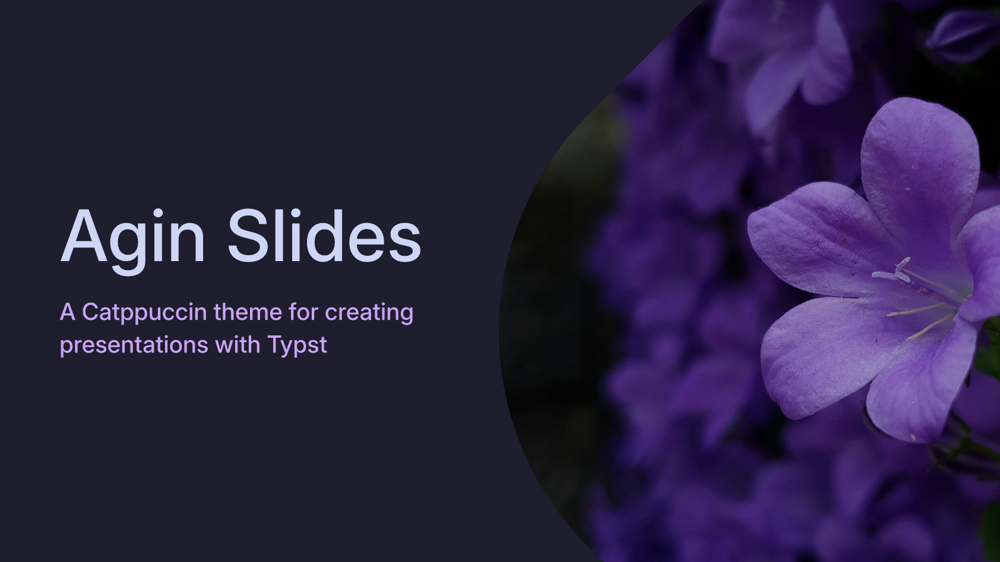

# Agin Slides

A beautiful Typst theme for creating presentations with the Catppuccin color palette.



## Features

- 🎨 **Catppuccin Color Palette**: Uses the popular Mocha flavor for a soothing, dark aesthetic
- 📐 **16:9 Presentation Format**: Optimized for modern presentation displays
- 🎯 **Multiple Slide Types**: Title slides, section slides, and content slides
- 🖼️ **Image Support**: Custom pill-shaped image frames for visual appeal
- ⚡ **Easy to Use**: Simple import and configuration

## Installation

1. Clone this repository or download the `lib.typ` file
2. Place `lib.typ` in your project directory
3. Import the library in your Typst document

## Usage

### Basic Setup

```typst
#import "lib.typ": *

#show: slides.with(title: "Your Presentation Title")
```

### Title Slide

Create an eye-catching title slide with optional subtitle and image:

```typst
#title-slide(
  title: "Your Presentation Title",
  subtitle: "An optional subtitle",
  image: "path/to/your/image.jpg", // Optional
)
```

### Section Slides

Organize your presentation with numbered section slides:

```typst
#section-slide("Section Title", subtitle: "Optional subtitle")
```

### Content Slides

Regular content slides using standard Typst markup:

```typst
#page[
  == Your Content Title

  Your content goes here. You can use:
  - Lists
  - **Bold text**
  - *Italic text*
  - Code blocks
  - And more!
]
```

## Typography

The theme uses the Inter font family with carefully chosen sizes:

- **Heading 1**: 40pt (60pt on title slides)
- **Heading 2**: 30pt
- **Heading 3**: 25pt
- **Body text**: 16pt

## Color Scheme

Based on the Catppuccin Mocha flavor:

- Text: Light foreground color
- Accent: Mauve purple for highlights and section numbers
- Background: Dark, comfortable for presentations

## File Structure

```
agin-slides/
├── lib.typ          # Main theme library
├── preview.typ      # Example presentation
├── preview.pdf      # Generated preview
├── preview.png      # Preview image
└── image.jpg        # Sample image
```

## Example

See `preview.typ` for a complete example of how to use all features of the theme.

## Requirements

- Typst
- Catppuccin package (`@preview/catppuccin:1.0.0`)
- Inter font (recommended)

## Contributing

Feel free to open issues or submit pull requests to improve the theme!

## License

This project is open source. Please check the license file for more details.
